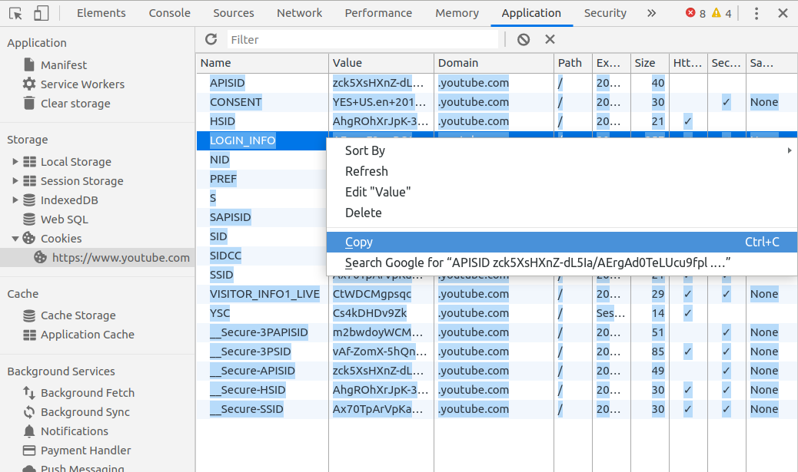

# Convert Chrome cookies to Netscape format

This is a very simple Node.js script to convert the cookies you can copy/paste from Chrome's Application -> Storage -> Cookies, into the [Netscape cookies format](https://curl.haxx.se/docs/http-cookies.html) accepted by tools like `curl` and `youtube-dl`.

It's useful because you don't have to install any browser extension in order to save or convert the cookies. [Browser extensions are a known security risk.](https://www.howtogeek.com/188346/why-browser-extensions-can-be-dangerous-and-how-to-protect-yourself/)


## Requirements

* A terminal/command line window
* [Node.js](https://nodejs.org/en/download/)


## Usage

1. Download [the script](https://raw.githubusercontent.com/dandv/convert-chrome-cookies-to-netscape-format/master/convert-cookies.js) (or clone this repo if you prefer).

2. In an editor, open a new blank file.

3. In Chrome/Chromium, launch Developer Tools (F12).

4. Navigate to the site you need cookies from, e.g. YouTube, and log in.

5. Go to Application -> Storage -> Cookies

6. For each URL under Cookies (e.g. `https://www.youtube.com`), copy the table of cookies into the clipboard, then paste it at the end of the file you've opened in step 2. 

7. Save the file with a name like `file-with-cookies-copy-pasted-from-Chrome.txt`

### Manually

8. Run the script:

       `node convert-cookies.js file-with-cookies-copy-pasted-from-Chrome.txt > netscape-cookies.txt`

Now, `netscape-cookies.txt` will contain cookies ready to be used by any application that reads cookies in Netscape format (e.g. `yotube-dl` or `curl`).

### Docker

8. Build the docker container: `docker build -t convert-cookies:latest .`

9. Run the container to get the cookies in Netscape format:

```bash
docker run --rm -i \
    -v "$(pwd)/file-with-cookies-copy-pasted-from-Chrome.txt:/usr/src/app/file-with-cookies-copy-pasted-from-Chrome.txt" \
    convert-cookies:latest
```

## Author

Copyright © 2020 [Dan Dascalescu](https://dandascalescu.com).
